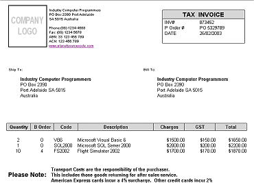



## HTML Invoice

### Description

This code creates a HTML Invoice and sends it using Outlook. I use this technique to send invoices to my customers. Demonstrates sending HTML mail via outlook.
 
### More Info
 

             |
---                |---
**Submitted On**   |2003-02-25 23:48:04
**By**             |[Matt Trigwell](https://github.com/Planet-Source-Code/PSCIndex/blob/master/ByAuthor/matt-trigwell.md)
**Level**          |Intermediate
**User Rating**    |4.2 (21 globes from 5 users)
**Compatibility**  |VB 6\.0
**Category**       |[Internet/ HTML](https://github.com/Planet-Source-Code/PSCIndex/blob/master/ByCategory/internet-html__1-34.md)
**World**          |[Visual Basic](https://github.com/Planet-Source-Code/PSCIndex/blob/master/ByWorld/visual-basic.md)
**Archive File**   |[HTML\_Invoi1550662252003\.zip](https://github.com/Planet-Source-Code/matt-trigwell-html-invoice__1-43543/archive/master.zip)

